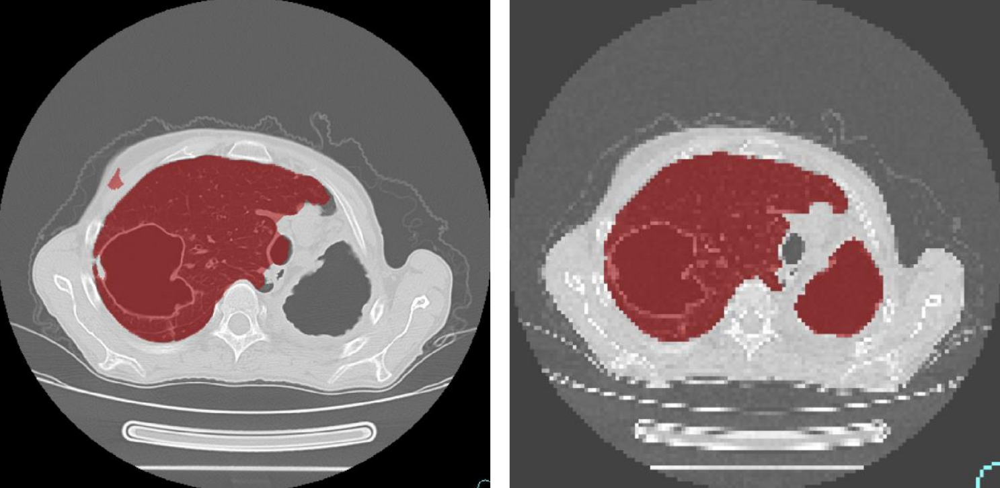

# Stable Lungs Segmentation

This repository contains the pipeline to train and use
deep learning model to segment lungs on 3D CT scans. 
The code is written with [PyTorch](https://pytorch.org/) framework.

There are 2 available backbones for segmentation models:
* [Unet](https://arxiv.org/abs/1505.04597)
* [MovileNetV2](https://arxiv.org/abs/1801.04381)
 that is used as encoder together with Unet-similar decoder

This project is a part of my Diploma Thesis dedicated to solving
the problem of Stable Lungs Segmentation in cases of:
* pathologies present in thoracic cavity
* lungs damaged due to different diseases 
* irregular lungs shape

### Example of segmentation improvements obtained during the work on Diploma Thesis



Left - __original__ lungs mask for 512x512 scan.
Right - **new mask** for 128x128 scan 
(zoom was used to reduce the model train time).

### Requirements and installation
To use the project you will need the Python3 
with additional packages installed.

To create a virtual environment with all the packages use
```
python3 -m venv venv
source venv/bin/activate
pip3 install -r requirements.txt
```
Or simply execute `venv_creation.sh` if you use Linux.

To run the code you will need to activate the virtual environment:

`source venv/bin/activate`


### Pipeline endpoints

There are couple of command line endpoints implemented with 
[Click](https://click.palletsprojects.com/en/7.x/) module
that make it easy to use the pipeline for different tasks. 

To call any endpoint use
```
(venv) $ python main.py <endpoint-name>
```

All the endpoints are to be called from the project root folder.

1. `train`

Use to build and train the model.
```
Usage: main.py train [OPTIONS]

Options:
  --launch [local|server]         launch location. used to determine default
                                  paths  [default: server]

  --architecture [unet|mnet2]     model architecture (unet, mnet2)  [default:
                                  unet]

  --device [cpu|cuda:0|cuda:1]    device to use  [default: cuda:0]
  --dataset [nifti|numpy]         dataset type  [default: numpy]
  --heavy-augs / --no-heavy-augs  whether to apply different number of
                                  augmentations for hard and regular train
                                  images (uses docs/hard_cases_mapping.csv to
                                  identify hard cases)  [default: True]

  --epochs INTEGER                max number of epochs to train  [required]
  --out TEXT                      path to dir to store training artifacts
  --max-batches INTEGER           max number of batches to process. use as
                                  sanity check. if no value passed than will
                                  process the whole dataset.

  --checkpoint TEXT               path to initial .pth checkpoint for warm
                                  start
```

2. `segment-scans`

Use to segment `.nii.gz` Nifti scans with already trained model stored in `.pth` file:
```
Usage: main.py segment-scans [OPTIONS]
  --help                          Show this message and exit.
Options:
  --launch [local|server]       launch location. used to determine default
                                paths  [default: server]

  --architecture [unet|mnet2]   model architecture (unet, mnet2)  [default:
                                unet]

  --device [cpu|cuda:0|cuda:1]  device to use  [default: cuda:0]
  --checkpoint TEXT             path to checkpoint .pth file
  --scans TEXT                  path to directory with nifti scans
  --subset [all|validation]     what scans to segment under --scans dir:
                                either all, or the ones from "validation"
                                dataset  [default: all]

  --out TEXT                    path to output directory with segmented masks
  --postfix TEXT                postfix to set for segmented masks  [default:
                                autolungs]

  --help                        Show this message and exit.

```

3. `create-numpy-dataset`

Use to create `numpy` dataset out of initial `.nii.gz` images.
This provides a significant decrease in train time. 
```
Usage: main.py create-numpy-dataset [OPTIONS]

Options:
  --launch [local|server]  launch location. used to determine default paths
                           [default: server]

  --scans TEXT             path to directory with nifti scans
  --masks TEXT             path to directory with nifti binary masks
  --zoom FLOAT             zoom factor for output images  [default: 0.25]
  --out TEXT               path to output directory with numpy dataset
  --help                   Show this message and exit.

```